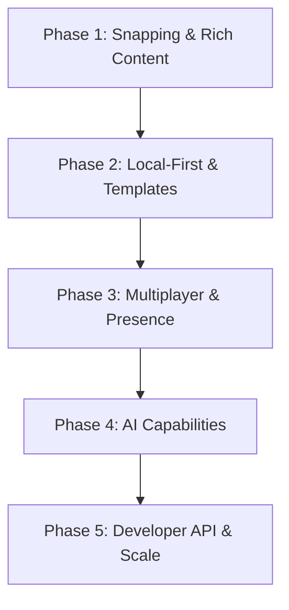

# 🚀 Kidraw — Industry-Grade Future Roadmap & Enhancements

This document outlines a detailed, production-grade roadmap of **24 new features, architectural upgrades, and enhancements** designed to elevate Kidraw to a top-tier visual workspace, competing directly with industry leaders like **Excalidraw**, **tldraw**, **Miro**, and **Figma**.

---

## 🗺️ Table of Contents

1. [Multiplayer & Collaboration](#1-multiplayer--collaboration)
2. [Advanced Drawing & Canvas Physics](#2-advanced-drawing--canvas-physics)
3. [Rich Content & Structuring](#3-rich-content--structuring)
4. [Media & Interactive Integrations](#4-media--interactive-integrations)
5. [AI-Assisted Design & Automation](#5-ai-assisted-design--automation)
6. [Developer-Centric Features](#6-developer-centric-features)
7. [Enterprise & Performance Upgrades](#7-enterprise--performance-upgrades)
8. [Mobile & UI/UX Polish](#8-mobile--uiux-polish)
9. [Phased Implementation Strategy](#phased-implementation-strategy)

---

## 👥 Multiplayer & Collaboration

### 1. Real-Time Presence & Live Cursors
* **Description:** Allow multiple users to work on the same canvas concurrently, displaying colored user cursors with name tags.
* **Technical Stack:** [Yjs](https://yjs.dev/) (CRDTs), WebSockets via [Liveblocks](https://liveblocks.io/) or self-hosted [Socket.io](https://socket.io/), and Zustand bindings (`@y-js/y-zustand`).
* **UX/UI Design:** 
  * Cursors float smoothly using CSS transitions (`transition: transform 80ms linear`).
  * Inactive user cursors fade out after 5 seconds of inactivity.
  * Clicking a user's avatar in the header initiates **"Follow Mode"**, locking your camera viewport to their viewport coordinates.
* **Industry Inspiration:** Figma, Miro, tldraw.
* **Priority / Difficulty:** 🔥 High / 🛠️ Hard

### 2. Figma-Style Cursor Chat
* **Description:** Press `/` to trigger a temporary chat bubble directly attached to the user's cursor for instant, context-aware communication.
* **Technical Stack:** Listen to standard `keydown` for `/` in the canvas container, appending a absolute-positioned floating input node. Broadcaster events synced via Yjs/WebSockets.
* **UX/UI Design:** 
  * Sleek bubble with a micro-bounce entry animation.
  * Self-destructs (fades away) 6 seconds after the user stops typing.
  * Tailored styling matching the user's cursor color.
* **Industry Inspiration:** Figma.
* **Priority / Difficulty:** Medium / Easy

### 3. Canvas Threads & Commenting
* **Description:** A commenting tool allowing users to drop pin-point comments on specific canvas coordinates or attach them to shapes.
* **Technical Stack:** Database schema updates (`Comment` model linked to `Board` and `UserId` with coordinates `x` and `y`). Frontend overlays absolute SVG buttons on the canvas coordinate space.
* **UX/UI Design:** 
  * Sleek pinging circle animation (`animate-ping`) on new/unread comments.
  * Sidebar container grouping resolved vs. unresolved threads.
  * Hovering over a comment pin previews the author, timestamp, and message.
* **Industry Inspiration:** Figma, Miro, Webflow.
* **Priority / Difficulty:** High / Medium

---

## 🎨 Advanced Drawing & Canvas Physics

### 4. Smart Connectors & Arrow Routing
* **Description:** Draw arrows between shapes that snap to shape boundaries and automatically route around obstacles.
* **Technical Stack:** A* pathfinding or Dijkstra algorithm for routing paths around bounding boxes, combined with mathematical intersection logic (e.g., line-ellipse, line-rectangle intersection).
* **UX/UI Design:** 
  * Hovering an arrow tool near a shape shows circular snap points.
  * Dragging an arrow near a shape highlights the destination with a subtle blue magnetic glow.
  * Moving a connected shape updates the arrow path automatically in real-time.
* **Industry Inspiration:** Miro, Draw.io, Excalidraw.
* **Priority / Difficulty:** 🔥 High / 🛠️ Hard

### 5. RoughJS Hand-Drawn Sketch Styling
* **Description:** Toggle between clean vector shapes and a rough, hand-drawn, sketch-like aesthetic.
* **Technical Stack:** Integrate [RoughJS](https://roughjs.com/) to draw shapes onto the canvas. Instead of Konva's built-in shapes, use custom `Konva.Shape` renderers utilizing RoughJS drawing contexts.
* **UX/UI Design:** 
  * Single global toggle button in the toolbar (e.g., "Sketch Mode").
  * Shapes drawn in sketch mode have randomized line strokes, filler patterns (hachure, zig-zag), and hand-written font (e.g., Virgil or Comic Sans).
* **Industry Inspiration:** Excalidraw.
* **Priority / Difficulty:** Medium / Medium

### 6. Bezier Curve Pen Tool & Path Smoothing
* **Description:** A vector pen tool that supports drawing curved lines (cubic bezier curves) with handle manipulation, plus automatic smoothing of freehand pen drawings.
* **Technical Stack:** Ramer-Douglas-Peucker (RDP) algorithm or Chaikin's algorithm for path simplification and smoothing. Math calculations to translate points into smooth SVG `d` paths.
* **UX/UI Design:** 
  * Clicking drops anchor points; dragging pulls out Bezier control handles (represented as circular helper nodes).
  * Hovering over control paths displays thin, dotted vector lines.
* **Industry Inspiration:** Figma, Adobe Illustrator.
* **Priority / Difficulty:** Medium / 🛠️ Hard

### 7. Canvas Frames / Artboards (✅ IMPLEMENTED)
* **Status:** Completed! Frame hierarchy and parent bounding boxes are now fully integrated.

---

## 📝 Rich Content & Structuring

### 8. Collaborative Sticky Notes (✅ IMPLEMENTED)
* **Status:** Completed! Auto-scaling text and styled rectangle containers are fully functional.

### 9. Mind-Mapping Nodes & Auto-Layout
* **Description:** Create nodes that connect hierarchically to form mind maps, with auto-layout features to clean up the workspace.
* **Technical Stack:** [D3-Hierarchy](https://github.com/d3/d3-hierarchy) or Dagre algorithm for computing automatic tree layouts on the canvas coordinate space.
* **UX/UI Design:** 
  * Selecting a node shows a floating `+` button in four directions.
  * Clicking `+` instantly generates a child node, connects it with an arrow, and centers keyboard focus on it.
* **Industry Inspiration:** Miro, Whimsical.
* **Priority / Difficulty:** Medium / 🛠️ Hard

### 10. Embedded Code Sandbox Component
* **Description:** Place functional code blocks on the canvas with syntax highlighting and code editing capability.
* **Technical Stack:** Render Monaco Editor or CodeMirror as an HTML overlay inside a Konva custom DOM portal (using CSS `transform: matrix3d` mapping).
* **UX/UI Design:** 
  * Syntax themes automatically match light/dark modes.
  * Copy-to-clipboard shortcut overlay button.
  * Resizing handles scale the code viewer bounding box smoothly.
* **Industry Inspiration:** tldraw (HTML embeds), Notion.
* **Priority / Difficulty:** Medium / Medium

---

## 🌐 Media & Interactive Integrations

### 11. Live HTML & Video Embeds
* **Description:** Embed active external resources (YouTube, Figma embeds, Spotify, or custom webpages) directly into canvas cards.
* **Technical Stack:** Use absolute-positioned `<iframe>` elements overlaid over the Konva stage, synchronized using 3D transformation matrices based on the zoom scale and camera coordinates.
* **UX/UI Design:** 
  * Shows a thumbnail state while dragging or panning; becomes interactive (receives mouse inputs) when zoomed in and selected.
  * Clean, rounded-corner card styling with a loading spinner.
* **Industry Inspiration:** Miro, tldraw, Muse.
* **Priority / Difficulty:** Low / 🛠️ Hard

### 12. Local Image & PDF Annotation (✅ IMPLEMENTED)
* **Status:** Completed! Multi-page PDF viewer directly embedded on the canvas with custom pagination controls.

---

## 🤖 AI-Assisted Design & Automation

### 13. Sketch-to-Vector (AI Drawing Clean-Up)
* **Description:** Use AI to analyze freehand hand-drawn scribbles and convert them into beautifully formatted vector shapes or icons.
* **Technical Stack:** Backend endpoint communicating with Gemini Flash Vision API (passing raw base64 drawing data) or local machine learning models like `TensorFlow.js` (for stroke classification).
* **UX/UI Design:** 
  * Floating AI assistant panel.
  * Clicking "Clean Up Drawing" overlays a sparkling dust animation (`lottie`) while substituting the scribble with a perfect SVG circle/rectangle/arrow.
* **Industry Inspiration:** tldraw make-real, Figma AI.
* **Priority / Difficulty:** 🔥 High / Medium

### 14. Text-to-Diagram Generator (LLM Integration)
* **Description:** Generate flowcharts, database ERDs, or system architecture diagrams directly from written prompts.
* **Technical Stack:** Prompt engineering targeting LLMs (Gemini / Claude) to output structured JSON representing nodes, coordinates, and arrows, which the canvas store then parses and renders.
* **UX/UI Design:** 
  * Floating command bar (triggered by `Ctrl + K` or an AI button).
  * Prompt input: "Generate a microservices flow for payment processing".
  * The canvas dynamically populates the diagram with an animated flow sequence.
* **Industry Inspiration:** Whimsical AI, Eraser.io.
* **Priority / Difficulty:** High / Medium

### 15. Diagram OCR & Summary Explainer
* **Description:** Select a portion of your canvas (diagram, mindmap, annotations) and have the AI explain the architecture or write out technical documentation.
* **Technical Stack:** Take a viewport snapshot (using `Stage.toDataURL()`), send it to the Gemini 1.5 Flash Vision endpoint, and return the structured markdown documentation.
* **UX/UI Design:** 
  * Selection box has an option to "Explain with AI".
  * Opens a sliding right-hand drawer presenting formatted markdown with a copy button.
* **Industry Inspiration:** Eraser.io.
* **Priority / Difficulty:** Medium / Easy

---

## 💻 Developer-Centric Features

### 16. Mermaid.js Import/Export Pipeline
* **Description:** Convert your canvas diagrams directly into Mermaid.js markdown syntax (and vice-versa).
* **Technical Stack:** [Mermaid.js parser](https://mermaid.js.org/). Parsing node names and connections to construct a diagram tree, translating it back and forth.
* **UX/UI Design:** 
  * Import: Paste Mermaid.js code blocks in a modal to generate shapes instantly.
  * Export: Right-click a group of shapes, select "Copy as Mermaid", copying syntax straight to the clipboard.
* **Industry Inspiration:** Eraser.io.
* **Priority / Difficulty:** High / Medium

### 17. Export to Tailwind/React Code
* **Description:** Select elements on the canvas and export them as functional React components styled with Tailwind CSS.
* **Technical Stack:** Translate absolute bounding boxes, colors, rounded corners, font sizes, and layout patterns (flex row/col heuristic based on alignment) into standard React code.
* **UX/UI Design:** 
  * "Copy as React Code" button in the selection toolbar.
  * Renders a code preview modal with syntax highlighting and a "Copy Code" button.
* **Industry Inspiration:** Figma, tldraw make-real.
* **Priority / Difficulty:** Medium / Medium

### 18. Developer API & Custom Webhooks
* **Description:** Allow developers to programmatically generate boards, fetch canvas JSON data, or trigger actions via webhooks (e.g., auto-update an architecture diagram on git commit).
* **Technical Stack:** Token-based API authentication (`/api/v1/` routes) with NextAuth or custom JWT tokens. Webhook subscription mechanism in database.
* **UX/UI Design:** 
  * A "Developer Console" tab in the profile settings dashboard.
  * Generate, revoke, and manage API keys.
* **Industry Inspiration:** Miro Developer Platform.
* **Priority / Difficulty:** Low / 🛠️ Hard

---

## ⚡ Enterprise & Performance Upgrades

### 19. Local-First & Offline Mode (CRDT + IndexedDB)
* **Description:** Enable fully offline operations, saving edits instantly locally, and seamlessly merging updates once an internet connection is established.
* **Technical Stack:** Yjs integration paired with [IndexedDB](https://developer.mozilla.org/en-US/docs/Web/API/IndexedDB_API) (via `y-indexeddb` provider) for local storage, combined with service workers.
* **UX/UI Design:** 
  * Cloud/Offline status indicator in the top-left HUD (Green cloud for synced, Gray outline with strike-through for offline).
  * In-app toast warning when connection changes.
* **Industry Inspiration:** Linear, tldraw.
* **Priority / Difficulty:** 🔥 High / 🛠️ Hard

### 20. Infinite Canvas Virtualization (LOD Rendering)
* **Description:** Support high-performance rendering of boards containing over 50,000 shapes without stuttering or dropping frame rates.
* **Technical Stack:** Level of Detail (LOD) rendering. Determine which shapes are within the current viewport (`camera.x`, `camera.y` + zoom scale) and cull off-screen shapes. Simplify rendering logic (e.g., render bounding boxes instead of complex SVG text) when zoomed out past 10%.
* **UX/UI Design:** 
  * Maintaining 60fps even when panning large boards.
  * Smooth transition animations when zooming in/out.
* **Industry Inspiration:** Figma, Miro.
* **Priority / Difficulty:** High / 🛠️ Hard

### 21. Canvas Version History & Time Travel
* **Description:** A historical timeline dashboard showing who made changes and when, allowing users to restore previous versions.
* **Technical Stack:** Database model tracking checkpoints/snapshots, or keeping a log of operations (event sourcing). In Yjs, this can be done using Yjs update history logs.
* **UX/UI Design:** 
  * A sliding time-travel panel with a visual slider.
  * Dragging the slider scrolls through previous visual states of the board.
* **Industry Inspiration:** Figma, Google Docs.
* **Priority / Difficulty:** Medium / 🛠️ Hard

### 22. Board Templates and UI Kit Library
* **Description:** A library of pre-built templates and standard UI components (buttons, input boxes, wireframe elements) to jump-start projects.
* **Technical Stack:** Asset collection stored in JSON format, loaded dynamically into a sidebar library picker.
* **UX/UI Design:** 
  * "Templates" dialog on empty boards showing categories: Agile, Flowcharts, Wireframes, Mind Maps.
  * Searchable sidebar panel containing drag-and-drop components (Wireframe iOS kit, flowchart symbols).
* **Industry Inspiration:** Miro, Whimsical.
* **Priority / Difficulty:** High / Easy

---

## 📱 8. Mobile & UI/UX Polish

### 23. Pinch-to-Zoom & Advanced Mobile Touch Handling
* **Description:** Provide a native app-like experience for tablet and mobile users with seamless two-finger panning and zooming.
* **Technical Stack:** Implement custom `onTouchMove` event listeners tracking the Euclidean distance and midpoint between two touch pointers, updating the Konva stage scale and position seamlessly.
* **UX/UI Design:** 
  * Smooth zooming with physics/momentum.
  * Palm rejection algorithms for iPad/tablet drawing.
* **Industry Inspiration:** Procreate, Figma Mobile, Concepts.
* **Priority / Difficulty:** 🔥 High / Medium

### 24. Context Menus & Cheat Sheet Modal
* **Description:** A robust context-menu system and comprehensive cheat sheet modal for power users.
* **Technical Stack:** Intercept standard right-click context menus (`onContextMenu`). Render custom floating React components using cursor coordinate positioning.
* **UX/UI Design:** 
  * Context menu offering actions like "Bring to Front", "Copy Style", "Group", and "Export".
  * Pressing `?` or `Cmd/Ctrl + /` reveals a beautiful, glassmorphic cheat sheet overlay showing all active hotkeys.
* **Industry Inspiration:** Linear, Miro, Notion.
* **Priority / Difficulty:** Medium / Easy

---

## 📅 Phased Implementation Strategy

Here is a proposed progression path to implement these upgrades systematically over five development phases.

### 🔹 Phase 1: Snapping & Rich Content (Foundation)
* **Features:** [Sticky Notes](#8-collaborative-sticky-notes), [Smart Connectors & Arrow Routing](#4-smart-connectors--arrow-routing), [Canvas Frames](#7-canvas-frames--artboards).
* **Objective:** Polish the core single-user editor experience to be extremely functional.

### 🔹 Phase 2: Local-First & Templates (Workspace Enhancement)
* **Features:** [Local-First & Offline Mode](#19-local-first--offline-mode-crdt--indexeddb), [Templates & UI Kits](#22-board-templates-and-ui-kit-library), [Image & PDF Annotation](#12-local-image-pdf-annotation).
* **Objective:** Ensure the app is incredibly responsive, works offline, and allows quick start options.

### 🔹 Phase 3: Multiplayer & Presence (Collaboration)
* **Features:** [Real-Time Presence](#1-real-time-presence--live-cursors), [Cursor Chat](#2-figma-style-cursor-chat), [Canvas Commenting](#3-canvas-threads--commenting).
* **Objective:** Enable multiplayer collaboration, turning Kidraw into a real-time team whiteboard.

### 🔹 Phase 4: AI Capabilities (Differentiator)
* **Features:** [Sketch-to-Vector AI](#13-sketch-to-vector-ai-drawing-clean-up), [Text-to-Diagram](#14-text-to-diagram-generator-llm-integration), [OCR Summary Explainer](#15-diagram-ocr--summary-explainer).
* **Objective:** Integrate Gemini API models to provide smart diagramming workflows.

### 🔹 Phase 5: Developer API & Scale (Platform)
* **Features:** [Mermaid.js Integration](#16-mermaidjs-importexport-pipeline), [React/Tailwind Export](#17-export-to-tailwindreact-code), [LOD Canvas Virtualization](#20-infinite-canvas-virtualization-lod-rendering), [Developer API](#18-developer-api--custom-webhooks).
* **Objective:** Turn Kidraw into an extensible platform for engineers and builders.
