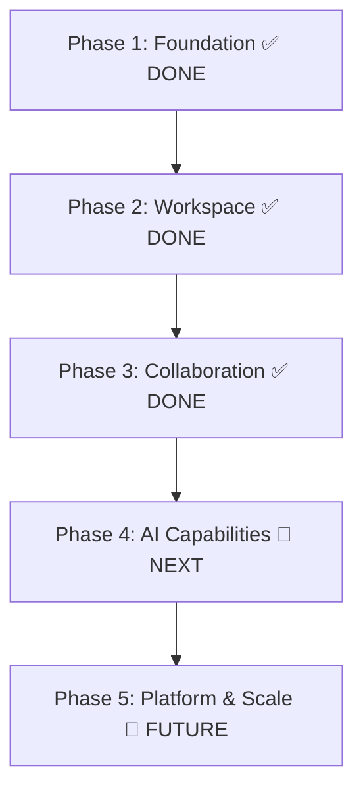

# 🚀 Kidraw — Industry-Grade Future Roadmap & Enhancements

This document outlines the **feature roadmap** for the Kidraw canvas application. Features that have already been shipped are marked with ✅. The remaining items represent the next wave of enhancements designed to elevate Kidraw to compete directly with **Excalidraw**, **tldraw**, **Miro**, and **Figma**.

> **Last Updated:** 2026-06-03

---

## 🗺️ Table of Contents

1. [Multiplayer & Collaboration](#1-multiplayer--collaboration)
2. [Advanced Drawing & Canvas Physics](#2-advanced-drawing--canvas-physics)
3. [Rich Content & Structuring](#3-rich-content--structuring)
4. [Media & Interactive Integrations](#4-media--interactive-integrations)
5. [AI-Assisted Design & Automation](#5-ai-assisted-design--automation)
6. [Developer-Centric Features](#6-developer-centric-features)
7. [Enterprise & Performance Upgrades](#7-enterprise--performance-upgrades)
8. [Mobile & UI/UX Polish](#8-mobile--uiux-polish)
9. [Phased Implementation Strategy](#9-phased-implementation-strategy)

---

## 👥 1. Multiplayer & Collaboration

### ✅ 1. Real-Time Presence & Live Cursors — SHIPPED
* **Status:** Fully implemented using **Server-Sent Events (SSE)** instead of WebSockets/Yjs.
* **What was built:**
  * `GET /api/board/[id]/presence` — SSE stream with global `clientsMap` on `globalThis` (dev-safe singleton).
  * `POST /api/board/[id]/presence` — Broadcasts cursor positions, drawing updates, and chat text to all other connected clients.
  * `usePresence` hook — Client-side SSE connection with 250ms throttled cursor broadcasts.
  * `usePresenceStore` — Zustand store for remote cursor state (position, name, color, chat text).
  * `LiveCursors` component — Figma-style colored cursor SVGs with username tags and chat bubbles.
  * Deterministic cursor colors from an 8-color palette based on userId hash.
  * 6-second idle timeout auto-removes stale cursors.
  * Guest support via `sessionStorage`-based guest IDs (no auth required).
  * Real-time drawing sync: `draw-add`, `draw-update`, `draw-update-batch`, `draw-remove` events.
* **Remaining work:**
  * Migrate from SSE to **WebSockets** or **Liveblocks** for better scalability with many concurrent users.
  * **"Follow Mode"** — clicking a user's avatar to lock camera viewport to their position.

### ✅ 2. Figma-Style Cursor Chat — SHIPPED
* **Status:** Fully implemented. Press `/` to trigger a chat bubble attached to the user's cursor.
* **What was built:**
  * Keyboard listener in `useKeyboardShortcuts` for `/` key activates cursor chat input.
  * Chat text is broadcast via the presence API and rendered as styled bubbles in `LiveCursors`.
  * Custom `animate-cursor-chat-pop` micro-bounce animation.
  * Bubble styling matches the user's deterministic cursor color.
* **Remaining work:** Auto-destruct (fade away) after 6 seconds of inactivity — currently text persists until user clears it.

### ✅ 3. Canvas Threads & Commenting — SHIPPED
* **Status:** Fully implemented with database persistence, spatial pins, threaded replies, and a sidebar panel.
* **What was built:**
  * `Comment` Prisma model with `x`, `y` coordinates, `resolved` boolean, self-referencing `parentId` for threads.
  * `GET/POST /api/board/[id]/comments` — Fetch and create top-level comments.
  * `POST/PATCH /api/comments/[id]` — Add replies and toggle resolved status.
  * `useCommentStore` — Zustand store with `fetchComments`, `addComment`, `addReply`, `toggleResolved`.
  * `CommentOverlay` — Canvas-space comment pins (violet for unresolved with `animate-ping`, emerald for resolved).
  * Hover preview tooltips showing author, timestamp, and truncated message.
  * Expanded thread popovers with full reply history and inline reply input.
  * `CommentSidebar` — Right-side panel with Open/Resolved tabs, reply input, pan-to-comment navigation.
* **Remaining work:**
  * Attach comments to specific shapes (not just canvas coordinates).
  * @mention other users in comments.
  * Real-time comment sync (currently requires page refresh to see other users' comments).

---

## 🎨 2. Advanced Drawing & Canvas Physics

### ✅ 4. Smart Connectors & Arrow Routing — SHIPPED
* **Status:** Fully implemented with A* orthogonal pathfinding and magnetic snapping.
* **What was built:**
  * `routing.ts` — A* orthogonal pathfinding algorithm that routes arrows around obstacle bounding boxes.
  * Sparse grid generation from obstacles, shortest path with turn penalties, collinear point simplification.
  * Falls back to straight lines if A* exceeds 1000 iterations.
  * `snapping.ts` — Magnetic snap-to-alignment engine comparing left/center/right and top/middle/bottom axes.
  * 5px tolerance threshold with visual guide lines rendered during drag.
  * Arrow `startBinding` and `endBinding` with snap points (top/right/bottom/left) on shapes.
  * Moving connected shapes auto-updates arrow routing in real-time.
* **Remaining work:**
  * Curved connector paths are now built in!
  * Visual snap point indicators (circular dots on shape edges) and magnetic blue glow highlight on destination shapes are now built in!

### ✅ 5. Rough.js Hand-Drawn Sketch Styling — SHIPPED
* **Status:** Fully implemented as a global toggle with `RoughShape` component.
* **What was built:**
  * `RoughShape.tsx` — Custom Konva `Shape` that wraps Rough.js drawing context.
  * Supports all shape types: rectangle, ellipse, triangle, diamond, hexagon, straight-line, arrow, pen, pencil.
  * Creates a fake canvas-like object wrapping Konva's context for Rough.js compatibility.
  * Arrow heads drawn manually with trigonometric calculations.
  * Hit regions implemented for all shape types including freehand paths.
  * `isSketchMode` toggle in `useCanvasStore` with `toggleSketchMode()` action.
  * Roughness: 1.5, Bowing: 1, Fill style: hachure.
* **Remaining work:**
  * Hand-written font (Virgil) for text in sketch mode is built in!
  * Per-shape sketch toggle is built in!
  * Configurable roughness/bowing parameters are built in!

### 6. Bezier Curve Pen Tool & Path Smoothing
* **Description:** A vector pen tool that supports drawing curved lines (cubic bezier curves) with handle manipulation, plus automatic smoothing of freehand pen drawings.
* **Technical Stack:** Ramer-Douglas-Peucker (RDP) algorithm or Chaikin's algorithm for path simplification and smoothing. Math calculations to translate points into smooth SVG `d` paths.
* **UX/UI Design:**
  * Clicking drops anchor points; dragging pulls out Bezier control handles (represented as circular helper nodes).
  * Hovering over control paths displays thin, dotted vector lines.
* **Industry Inspiration:** Figma, Adobe Illustrator.
* **Priority / Difficulty:** Medium / 🛠️ Hard

### ✅ 7. Canvas Frames / Artboards — SHIPPED
* **Status:** Completed! Frame hierarchy and parent bounding boxes are now fully integrated with `parentId` relationships and labeled frame headers.

---

## 📝 3. Rich Content & Structuring

### ✅ 8. Collaborative Sticky Notes — SHIPPED
* **Status:** Completed! Auto-scaling text, 5 color options, and styled rectangle containers are fully functional.

### ✅ 9. Mind-Mapping Nodes & Auto-Layout (Quick Add) — SHIPPED
* **Status:** Completed! When a shape is selected, four directional `+` buttons appear. Clicking one instantly clones the shape, offsets it, connects it with an arrow, and triggers text editing.
* **What was built:**
  * `MindMapOverlay.tsx` HTML portal overlay.
  * Clones the active layer, computes layout offset, and automatically generates an `arrow` connecting the two using `startBinding` and `endBinding`.

### 10. Embedded Code Sandbox Component
* **Description:** Place functional code blocks on the canvas with syntax highlighting and live code editing capability.
* **Technical Stack:** Render Monaco Editor or CodeMirror as an HTML overlay inside a Konva custom DOM portal (using CSS `transform: matrix3d` mapping).
* **UX/UI Design:**
  * Syntax themes automatically match light/dark modes.
  * Copy-to-clipboard shortcut overlay button.
  * Resizing handles scale the code viewer bounding box smoothly.
* **Note:** A basic `code` layer type exists but lacks syntax highlighting or live editing. This would be a significant upgrade.
* **Industry Inspiration:** tldraw (HTML embeds), Notion.
* **Priority / Difficulty:** Medium / Medium

---

## 🌐 4. Media & Interactive Integrations

### 11. Live HTML & Video Embeds
* **Description:** Embed active external resources (YouTube, Figma embeds, Spotify, or custom webpages) directly into canvas cards.
* **Technical Stack:** Use absolute-positioned `<iframe>` elements overlaid over the Konva stage, synchronized using 3D transformation matrices based on the zoom scale and camera coordinates.
* **UX/UI Design:**
  * Shows a thumbnail state while dragging or panning; becomes interactive (receives mouse inputs) when zoomed in and selected.
  * Clean, rounded-corner card styling with a loading spinner.
* **Note:** A basic `embed` layer type and `embedUrl` property exist in the type system but the iframe rendering is not yet implemented.
* **Industry Inspiration:** Miro, tldraw, Muse.
* **Priority / Difficulty:** Low / 🛠️ Hard

### ✅ 12. Local Image & PDF Annotation — SHIPPED
* **Status:** Completed! Multi-page PDF viewer directly embedded on the canvas with custom pagination controls via `pdf.ts` loader. Image upload via Base64 encoding with max 800px scaling.

---

## 🤖 5. AI-Assisted Design & Automation

### 13. Sketch-to-Vector (AI Drawing Clean-Up)
* **Description:** Use AI to analyze freehand hand-drawn scribbles and convert them into beautifully formatted vector shapes or icons.
* **Technical Stack:** Backend endpoint communicating with Gemini Flash Vision API (passing raw base64 drawing data) or local machine learning models like `TensorFlow.js` (for stroke classification).
* **UX/UI Design:**
  * Floating AI assistant panel.
  * Clicking "Clean Up Drawing" overlays a sparkling dust animation (`lottie`) while substituting the scribble with a perfect SVG circle/rectangle/arrow.
* **Industry Inspiration:** tldraw make-real, Figma AI.
* **Priority / Difficulty:** 🔥 High / Medium

### 14. Text-to-Diagram Generator (LLM Integration)
* **Description:** Generate flowcharts, database ERDs, or system architecture diagrams directly from written prompts.
* **Technical Stack:** Prompt engineering targeting LLMs (Gemini / Claude) to output structured JSON representing nodes, coordinates, and arrows, which the canvas store then parses and renders via `addLayers()`.
* **UX/UI Design:**
  * Floating command bar (triggered by `Ctrl + K` or an AI button).
  * Prompt input: "Generate a microservices flow for payment processing".
  * The canvas dynamically populates the diagram with an animated flow sequence.
* **Industry Inspiration:** Whimsical AI, Eraser.io.
* **Priority / Difficulty:** High / Medium

### 15. Diagram OCR & Summary Explainer
* **Description:** Select a portion of your canvas (diagram, mindmap, annotations) and have the AI explain the architecture or write out technical documentation.
* **Technical Stack:** Take a viewport snapshot (using `Stage.toDataURL()`), send it to the Gemini 1.5 Flash Vision endpoint, and return the structured markdown documentation.
* **UX/UI Design:**
  * Selection box has an option to "Explain with AI".
  * Opens a sliding right-hand drawer presenting formatted markdown with a copy button.
* **Industry Inspiration:** Eraser.io.
* **Priority / Difficulty:** Medium / Easy

---

## 💻 6. Developer-Centric Features

### ✅ 16. Mermaid.js Export & Import — SHIPPED
* **Status:** Both Export and Import are fully implemented.
* **What was built:**
  * `exportMermaid.ts` — Converts canvas shapes + connected arrows into Mermaid.js flowchart syntax.
  * Maps shape types to Mermaid node syntax: rectangle → `[]`, ellipse → `()`, diamond → `{}`, hexagon → `{{}}`.
  * Traces arrow `startBinding`/`endBinding` to generate `-->` connections.
  * Uses shape `text` content as node labels.
  * `ExportCodeModal` — Displays generated Mermaid code with syntax coloring and copy-to-clipboard.
  * `importMermaid.ts` — Parses `graph TD`/`graph LR` syntax into nodes and edges, applying an automatic rank-based layout heuristic to build diagrams from text.
  * `ImportMermaidModal` — Allows pasting Mermaid code to instantly spawn interactive canvas flowcharts.

### ✅ 17. Export to Tailwind/React Code — SHIPPED
* **Status:** Fully implemented with intelligent layout engine.
* **What was built:**
  * `exportReact.ts` — Translates canvas layers into a React component with Tailwind classes.
  * **Layout Heuristic Engine:** Replaced absolute positioning with a recursive axis-projection algorithm. The engine detects when elements are aligned side-by-side or stacked vertically, and automatically groups them into `flex-row` or `flex-col` containers with calculated `gap` properties.
  * Handles rectangles, ellipses, text, sticky notes, and frames.
  * `ExportCodeModal` — Displays generated responsive React code with syntax coloring and copy-to-clipboard.

### 18. Developer API & Custom Webhooks
* **Description:** Allow developers to programmatically generate boards, fetch canvas JSON data, or trigger actions via webhooks (e.g., auto-update an architecture diagram on git commit).
* **Technical Stack:** Token-based API authentication (`/api/v1/` routes) with NextAuth or custom JWT tokens. Webhook subscription mechanism in database.
* **UX/UI Design:**
  * A "Developer Console" tab in the profile settings dashboard.
  * Generate, revoke, and manage API keys.
* **Note:** A dedicated `/info/developers-api` page exists but is currently informational only.
* **Industry Inspiration:** Miro Developer Platform.
* **Priority / Difficulty:** Low / 🛠️ Hard

---

## ⚡ 7. Enterprise & Performance Upgrades

### 19. Local-First & Offline Mode (CRDT + IndexedDB)
* **Description:** Enable fully offline operations, saving edits instantly locally, and seamlessly merging updates once an internet connection is established.
* **Technical Stack:** Yjs integration paired with [IndexedDB](https://developer.mozilla.org/en-US/docs/Web/API/IndexedDB_API) (via `y-indexeddb` provider) for local storage, combined with service workers.
* **UX/UI Design:**
  * Cloud/Offline status indicator in the top-left HUD (Green cloud for synced, Gray outline with strike-through for offline).
  * In-app toast warning when connection changes.
* **Industry Inspiration:** Linear, tldraw.
* **Priority / Difficulty:** 🔥 High / 🛠️ Hard

### ✅ 20. Infinite Canvas Virtualization (LOD Rendering) — SHIPPED
* **Status:** Completed! The canvas automatically culls off-screen shapes and simplifies details when zoomed out.
* **What was built:**
  * Viewport bounding box intersection checks in `Board.tsx` skip rendering layers completely if they are out of the camera view.
  * Level of Detail (LOD) trigger: `isLowDetail = zoom < 0.4`.
  * `LayerRenderer.tsx` respects `isLowDetail` by hiding text components and disabling complex Sketch mode rendering, ensuring massive boards stay at 60fps.

### ✅ 21. Canvas Time Travel & History Slider — SHIPPED (In-Memory Only)
* **Status:** In-memory time travel is fully implemented. Database-persisted version history is not yet built.
* **What was built:**
  * `history` and `historyStep` state in `useCanvasStore` — full undo/redo stack with state snapshots.
  * `saveHistory()`, `undo()`, `redo()`, `jumpToHistoryStep()` actions.
  * `TimeTravelSlider` widget — visual slider to scrub through history with play/pause animation.
  * Auto-rewind when pressing play at the end of history.
  * 300ms per step during playback.
* **Remaining work:**
  * **Database-persisted version history** — Save named checkpoints/snapshots to the database.
  * **User attribution** — Track which user made each change.
  * **Restore previous versions** — Allow reverting the board to a prior checkpoint.
  * **Visual diff** — Show what changed between versions.

### ✅ 22. Board Templates and UI Kit Library — SHIPPED
* **Status:** Fully implemented with sidebar panel, search, and one-click insertion.
* **What was built:**
  * `library.ts` (679 lines) — Defines templates and UI components with `createLayers()` factory functions.
  * **Templates:** Flowchart, Kanban Board, Mind Map — multi-layer compositions with frames, shapes, arrows, text.
  * **UI Components:** Button, Input Field, Card Container, Toggle Switch, Checkbox Option, Dropdown Selector.
  * `LibrarySidebar` — Left-side panel with 3 tabs (Templates / Components / Shortcuts), search filtering, miniature HTML previews.
  * `createNewBoard` server action — Supports template-based board creation (Blank, Flowchart, Wireframe, Architecture).
  * Items insert at current viewport center via `addLayers()` batch action.
* **Remaining work:**
  * **Custom user templates** — Let users save their own designs as reusable templates.
  * **Community template marketplace** — Share and discover templates created by other users.
  * **Drag-and-drop insertion** — Currently click-to-insert; drag from sidebar would be more intuitive.
  * **More templates** — Wireframe kits (iOS, Android, Web), SWOT analysis, user journey maps, ERD diagrams.

---

## 📱 8. Mobile & UI/UX Polish

### ✅ 23. Touch Handling & Mobile Responsiveness — PARTIALLY SHIPPED
* **Status:** Basic touch support and responsive toolbars are implemented.
* **What was built:**
  * `onTouchStart`, `onTouchMove`, `onTouchEnd` handlers in `Board.tsx`.
  * Scroll-to-zoom with Ctrl/Cmd modifier.
  * Responsive toolbar collapsing on mobile viewports.
  * Mobile hamburger menu in `GlobalNavbar`.
* **Remaining work:**
  * **Two-finger pinch-to-zoom** with smooth physics/momentum.
  * **Palm rejection** algorithms for iPad/tablet drawing.
  * **Mobile-optimized tool picker** (bottom sheet instead of top toolbar).
  * **Gesture shortcuts** (two-finger swipe for undo, three-finger tap for redo).

### 24. Context Menus & Right-Click Actions
* **Description:** A robust context-menu system for power users with quick access to common operations.
* **Technical Stack:** Intercept standard right-click context menus (`onContextMenu`). Render custom floating React components using cursor coordinate positioning.
* **UX/UI Design:**
  * Context menu offering actions like "Bring to Front", "Copy Style", "Group", "Export as Mermaid", and "Delete".
  * Pressing `?` or `Cmd/Ctrl + /` reveals a beautiful, glassmorphic cheat sheet overlay showing all active hotkeys.
* **Note:** Keyboard shortcuts are fully implemented (23 shortcuts) and documented in the Library sidebar's Shortcuts tab. A dedicated `/info/keyboard-shortcuts` page also exists. This feature would add the right-click context menu.
* **Industry Inspiration:** Linear, Miro, Notion.
* **Priority / Difficulty:** Medium / Easy

---

## 🔮 Additional Future Ideas (Not Yet Scoped)

These are ideas that emerged during development but haven't been fully designed:

| Idea                              | Description                                                       | Difficulty |
|-----------------------------------|-------------------------------------------------------------------|------------|
| **Real-time auto-save**           | Auto-save to cloud on a debounced timer instead of manual save    | Easy       |
| **Board deletion**                | Delete boards from the dashboard (currently not possible)         | Easy       |
| **Board search & filtering**      | Search boards by title/description on the dashboard               | Easy       |
| **Board sorting options**         | Sort by name, created date, updated date (currently always updatedAt desc) | Easy |
| **Board thumbnails**              | Generate and display canvas preview thumbnails on board cards     | Medium     |
| **Board title editing**           | Edit board title/description after creation (currently set-at-creation only) | Easy |
| **Permission enforcement**        | Server-side role enforcement for Viewer/Commenter/Editor roles    | Medium     |
| **Invite by email**               | Invite collaborators via email with role assignment               | Medium     |
| **Font family picker**            | Choose from multiple font families for text layers                | Easy       |
| **Line style options**            | Dashed, dotted, and custom dash patterns for lines/arrows         | Easy       |
| **Arrow inline labels**           | Text labels positioned along arrow connectors                     | Medium     |
| **Stripe billing integration**    | Actual payment processing on the billing page                     | Hard       |
| **Email-based authentication**    | Magic link or password auth in addition to OAuth                  | Medium     |
| **Board sharing with permissions**| Generate shareable links with enforced Viewer/Editor roles        | Medium     |
| **Real-time comment sync**        | Broadcast new comments via SSE so all users see them instantly    | Medium     |
| **Presentation mode**             | Full-screen frame-by-frame presentation mode                      | Medium     |
| **Canvas search**                 | Find shapes/text on the canvas by keyword                         | Easy       |

---

## 📅 9. Phased Implementation Strategy

The original 5-phase plan has been **significantly completed**. Here is the updated progression reflecting current status and remaining work:

### ✅ Phase 1: Snapping & Rich Content — COMPLETED
* **Delivered:** Sticky Notes, Smart Connectors & Arrow Routing (A*), Canvas Frames, Magnetic Snapping Guides, Sketch Mode (Rough.js), Keyboard Shortcuts, Copy/Paste, Z-ordering, Grouping.

### ✅ Phase 2: Workspace Enhancement — COMPLETED
* **Delivered:** Templates & UI Kit Library (sidebar + board creation templates), Image Upload, PDF Annotation, SVG/PDF Export, React/Tailwind Code Export, Mermaid.js Export, Time Travel Slider, Dark/Light Theme Toggle.
* **Remaining:** Local-First / Offline Mode (deferred to Phase 5).

### ✅ Phase 3: Multiplayer & Collaboration — COMPLETED
* **Delivered:** Real-Time Presence (SSE), Live Cursors, Cursor Chat, Canvas Commenting (threaded, database-persisted), Comment Sidebar, Drawing Sync, Guest Support.
* **Remaining:** Follow Mode, WebSocket migration for better scale.

### 🔲 Phase 4: AI Capabilities — NEXT PRIORITY
* **Planned:** Sketch-to-Vector AI, Text-to-Diagram Generator (LLM), Diagram OCR & Summary Explainer.
* **Objective:** Integrate Gemini API models to provide smart diagramming workflows. This is the primary differentiator from competitors.
* **Prerequisites:** None — can be built on top of existing canvas infrastructure using `Stage.toDataURL()` for screenshots and `addLayers()` for diagram generation.

### 🔲 Phase 5: Developer Platform & Scale — FUTURE
* **Planned:** Mermaid.js Import, Developer API & Webhooks, LOD Canvas Virtualization, Local-First/Offline Mode, Database-Persisted Version History.
* **Objective:** Turn Kidraw into an extensible, enterprise-ready platform for engineers and builders.

---

## 📊 Implementation Score Card

| Category                 | Total Items | Shipped ✅ | Remaining 🔲 | Completion |
|--------------------------|:-----------:|:----------:|:-------------:|:----------:|
| Multiplayer & Collab     | 3           | 3          | 0*            | **100%**   |
| Drawing & Canvas Physics | 4           | 3          | 1             | **75%**    |
| Rich Content             | 3           | 2          | 1             | **67%**    |
| Media & Integrations     | 2           | 1          | 1             | **50%**    |
| AI Features              | 3           | 0          | 3             | **0%**     |
| Developer Features       | 3           | 2          | 1             | **67%**    |
| Enterprise & Performance | 4           | 2          | 2             | **50%**    |
| Mobile & UI/UX           | 2           | 1          | 1             | **50%**    |
| **TOTAL**                | **24**      | **14**     | **10**        | **58%**    |

> \* All 3 collaboration features are shipped but have remaining polish items (Follow Mode, WebSocket migration, comment @mentions).

---

> **Reference Documents:**
> - [PROJECT_REFERENCE.md](file:///d:/dev/UNIQUE%20WORK/kidraw/docs/PROJECT_REFERENCE.md) — Complete current-state documentation
> - [ARCHITECTURE_MIGRATION.md](file:///d:/dev/UNIQUE%20WORK/kidraw/docs/ARCHITECTURE_MIGRATION.md) — Architecture migration history
